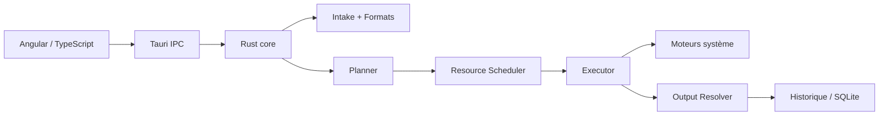

<p align="center">
  
</p>

<h1 align="center">FileFlow</h1>

<p align="center">
  <strong>Transformer, organiser et automatiser les fichiers depuis une application desktop native.</strong>
</p>

<p align="center">
FileFlow orchestre des moteurs de conversion système éprouvés derrière une interface unifiée.
Le logiciel privilégie l’exécution locale, la traçabilité, les sorties déterministes et un packaging natif Windows, macOS et Linux.
</p>

---

## Qu’est-ce que FileFlow ?

**FileFlow est une station de transformation de fichiers multiplateforme.**

L’utilisateur sélectionne des fichiers, FileFlow détecte leurs formats, détermine les actions compatibles, planifie les moteurs nécessaires, contrôle la concurrence, exécute les conversions puis finalise les résultats selon une politique de destination et de conflit.

Version du workspace documentée : **1.0.6**.

## Ce que FileFlow sait faire

- convertir des images individuellement ou par lot ;
- créer des PDF à partir d’images, HEIC/HEIF, HTML, EML ou de collections ;
- fusionner, découper, valider et transformer des PDF ;
- effectuer de l’OCR ;
- convertir des documents Office et des formats structurés ;
- traiter des médias avec FFmpeg ;
- créer et extraire des archives ;
- compresser/décompresser avec zstd et LZ4 ;
- gérer les métadonnées ;
- organiser les sorties, l’historique, les favoris et les automatisations ;
- fonctionner avec des moteurs système installés sur Windows, macOS et Linux.

Les pages HTML sont imprimées dans un navigateur Chromium isolé : JavaScript est autorisé pendant une durée bornée pour rendre les contenus dynamiques, tandis que le réseau et le DNS restent désactivés. Les e-mails EML suivent un chemin distinct qui neutralise HTML et scripts avant la création du PDF.

## Documentation

| Ressource | Objet |
| --- | --- |
| [Index documentaire](doc/INDEX.md) | Navigation globale |
| [Architecture](doc/01-architecture.md) | Couches, crates, IPC, moteurs |
| [Technologies](doc/02-technologies.md) | Technologie → responsabilité |
| [Algorithmes & complexité](doc/03-algorithms.md) | Implémentations et coûts |
| [Graphe vers PDF](doc/04-pdf-transformation-graph.md) | Pipeline Smart-to-PDF |
| [Fonctionnalités](doc/05-features.md) | Catalogue fonctionnel |
| [Interface](doc/06-ui.md) | Parcours 5 étapes + espaces avancés |
| [CI/CD](doc/07-ci-cd.md) | Workflows et distribution |
| [Difficultés](doc/08-difficulties.md) | Incidents et solutions |
| [Exécution](doc/09-execution.md) | Local + GitHub Actions |
| [Installation](doc/10-installation.md) | Installateur général |
| [Setup et portail Cloudflare](docs/SETUP.md) | Installation, maintenance, désinstallation et publication web |

## Installation rapide avec FileFlow Setup

Le [portail de téléchargement FileFlow](https://fileflow-downloads.pages.dev) détecte la plateforme et propose le Setup graphique adapté. Il affiche le diagnostic, le plan, la progression réelle et les post-contrôles ; une opération interrompue est restaurée.

Depuis un terminal macOS/Linux :

macOS / Linux :

```bash
curl -fsSL https://fileflow-downloads.pages.dev/install.sh | sh
```

Windows PowerShell :

```bash
irm https://fileflow-downloads.pages.dev/install.ps1 | iex
```

Le fichier `install-fileflow-one-general.sh` reste téléchargeable pour les utilisateurs qui préfèrent inspecter le script avant de l’exécuter. `install.sh` et `install.ps1` sont conservés comme installateurs historiques de secours et outils développeur.

Voir [Installation générale](doc/10-installation.md).

## Architecture en un coup d’œil



## Principe d’ingénierie

FileFlow ne réimplémente pas FFmpeg, qpdf, Tesseract ou LibreOffice. Il construit au-dessus d’eux une couche produit : détection, planification, gestion des chemins, contrôle des ressources, annulation, staging, validation, historique et interface utilisateur.

---

**Commencer par [`doc/INDEX.md`](doc/INDEX.md).**
