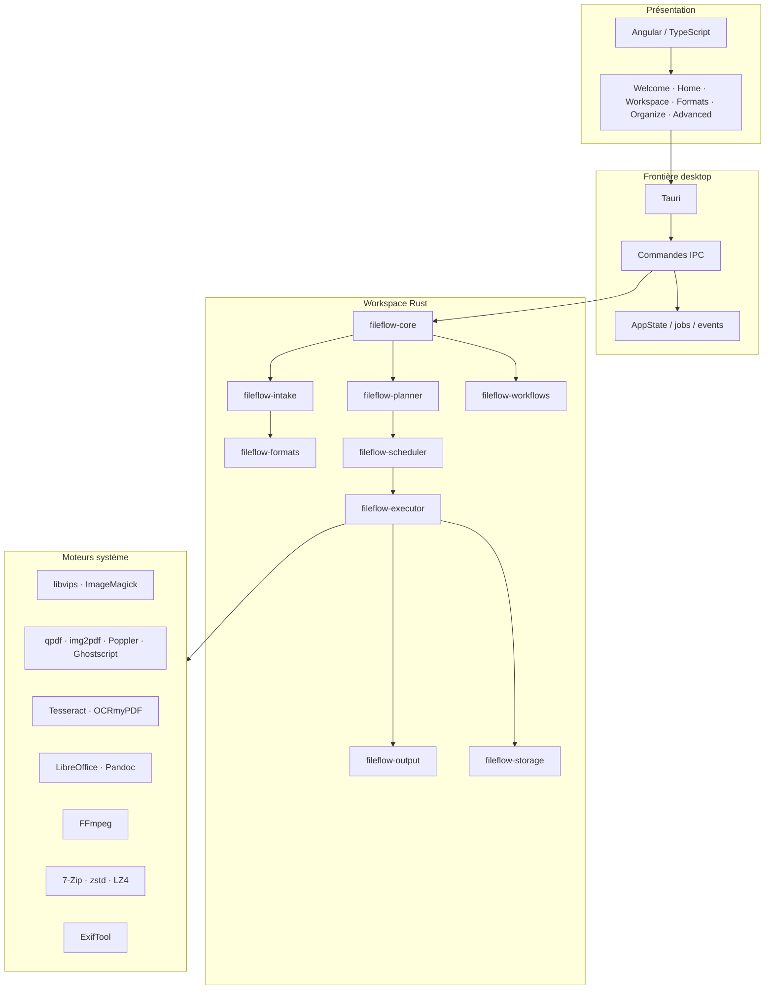
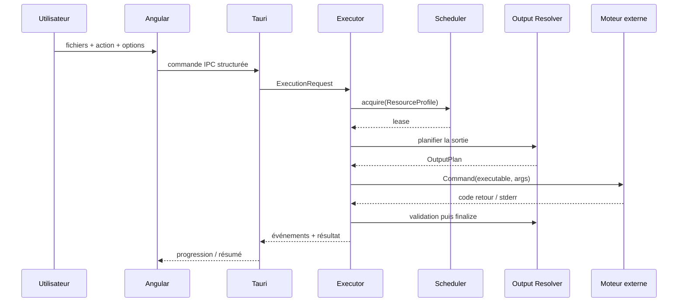

# Architecture générale

## Vue système

## Séquence d’une conversion

## Crates et responsabilités

| Composant | Responsabilité |
| --- | --- |
| `crates/adapters/fileflow-adapter-archive` | Adaptateur fin entre un moteur externe et les contrats FileFlow. |
| `crates/adapters/fileflow-adapter-ffmpeg` | Adaptateur fin entre un moteur externe et les contrats FileFlow. |
| `crates/adapters/fileflow-adapter-ghostscript` | Adaptateur fin entre un moteur externe et les contrats FileFlow. |
| `crates/adapters/fileflow-adapter-imagemagick` | Adaptateur fin entre un moteur externe et les contrats FileFlow. |
| `crates/adapters/fileflow-adapter-img2pdf` | Adaptateur fin entre un moteur externe et les contrats FileFlow. |
| `crates/adapters/fileflow-adapter-lz4` | Adaptateur fin entre un moteur externe et les contrats FileFlow. |
| `crates/adapters/fileflow-adapter-metadata` | Adaptateur fin entre un moteur externe et les contrats FileFlow. |
| `crates/adapters/fileflow-adapter-ocr` | Adaptateur fin entre un moteur externe et les contrats FileFlow. |
| `crates/adapters/fileflow-adapter-office` | Adaptateur fin entre un moteur externe et les contrats FileFlow. |
| `crates/adapters/fileflow-adapter-pandoc` | Adaptateur fin entre un moteur externe et les contrats FileFlow. |
| `crates/adapters/fileflow-adapter-poppler` | Adaptateur fin entre un moteur externe et les contrats FileFlow. |
| `crates/adapters/fileflow-adapter-qpdf` | Adaptateur fin entre un moteur externe et les contrats FileFlow. |
| `crates/adapters/fileflow-adapter-tesseract` | Adaptateur fin entre un moteur externe et les contrats FileFlow. |
| `crates/adapters/fileflow-adapter-vips` | Adaptateur fin entre un moteur externe et les contrats FileFlow. |
| `crates/adapters/fileflow-adapter-zstd` | Adaptateur fin entre un moteur externe et les contrats FileFlow. |
| `crates/fileflow-analysis` | Analyse d’assets et recommandations d’actions. |
| `crates/fileflow-core` | Composition des services métier FileFlow. |
| `crates/fileflow-domain` | Modèle métier : jobs, formats, politiques de sortie, ressources et identifiants. |
| `crates/fileflow-engine` | Découverte, résolution et disponibilité des moteurs système. |
| `crates/fileflow-executor` | Orchestration asynchrone des jobs et lancement des moteurs externes. |
| `crates/fileflow-formats` | Registre de formats, familles et règles liées aux types de fichiers. |
| `crates/fileflow-intake` | Ingestion, détection initiale et préparation des entrées. |
| `crates/fileflow-output` | Résolution destination/nommage/conflits et staging transactionnel. |
| `crates/fileflow-planner` | Catalogue de capacités et planification des étapes de conversion. |
| `crates/fileflow-scheduler` | Concurrence bornée et attribution de profils de ressources. |
| `crates/fileflow-storage` | Persistance locale, historique et données applicatives. |
| `crates/fileflow-workflows` | Recettes et enchaînements automatisés. |
| `crates/fileflow-workspace` | Racines de workspace et contexte des assets. |
| `src-tauri` | Frontière desktop : Tauri, commandes IPC, état applicatif et packaging. |

## Frontière des processus externes

Les moteurs sont lancés via `tokio::process::Command` avec des arguments distincts. Les chemins utilisateur ne sont pas interpolés dans une commande shell.

Cette frontière accueille les adaptations de plateforme :
- sous Linux AppImage, retrait des variables d’environnement qui pourraient contaminer les moteurs système ;
- sous Windows, normalisation des chemins natifs qui ne sont pas acceptés tels quels par certains CLI.

## Sorties transactionnelles

`fileflow-output` distingue :
- le dossier destination ;
- le chemin final ;
- le chemin temporaire ;
- la stratégie de conflit ;
- la phase de finalisation.

Le résultat visible par l’utilisateur n’est donc pas confondu avec un fichier intermédiaire encore incomplet.

## Persistance et historique

La persistance est séparée du moteur d’exécution. Les jobs et résultats peuvent être historisés sans coupler directement la logique de conversion à l’interface.
