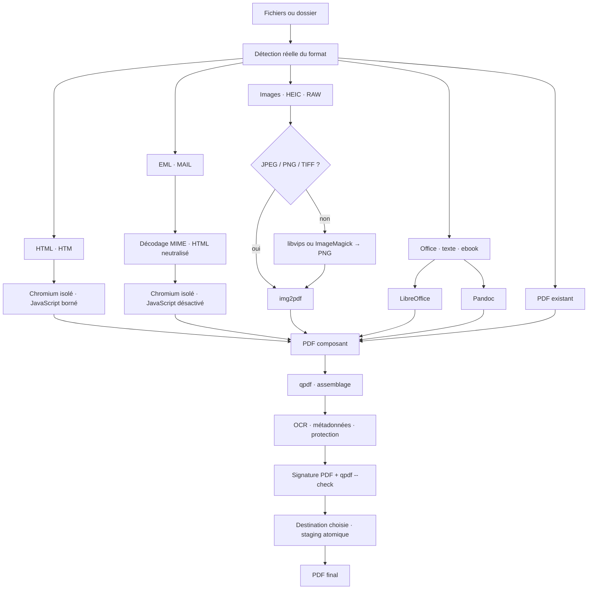

# Graphe de transformation vers PDF

Le mode Smart-to-PDF fait converger les fichiers reconnus vers un PDF validé. Le planificateur choisit un chemin uniquement lorsqu'un moteur réellement disponible peut l'exécuter.

## HTML et scripts

Les pages HTML sont imprimées par Chrome, Chromium ou Edge en mode headless. JavaScript reste actif afin de permettre le rendu des applications et graphiques dynamiques, mais l'exécution est bornée à cinq secondes. Le profil temporaire est isolé, les extensions sont désactivées et les requêtes réseau ainsi que la résolution DNS sont bloquées. Un document HTML local peut donc exécuter son rendu sans transformer la conversion en navigateur généraliste connecté.

## E-mails EML

Un e-mail n'est jamais ouvert comme une page web active. FileFlow décode les en-têtes, les contenus Base64 ou quoted-printable et les parties MIME pertinentes, neutralise les balises et scripts, puis génère une représentation HTML échappée. L'impression PDF s'effectue ensuite avec JavaScript désactivé.

## Images étendues

JPEG, PNG et TIFF sont transmis directement à img2pdf. HEIC/HEIF, AVIF, WebP, JPEG XL, RAW et les formats plus rares reconnus sont d'abord normalisés en PNG par libvips, avec ImageMagick comme solution de repli. La disponibilité réelle du codec dépend des codecs installés avec ces moteurs.

## Validation et destination

FileFlow contrôle l'existence, la taille minimale et la signature `%PDF-`. Lorsque qpdf est disponible, il ajoute `qpdf --warning-exit-0 --check`. Le pipeline valide le PDF de travail puis le fichier copié vers le staging final. La destination explicitement sélectionnée dans l'interface prime sur la destination guidée et les conflits n'écrasent jamais silencieusement un fichier existant.

## Workspace temporaire

Les composants, profils de navigateur et fichiers techniques restent dans un workspace de job. Le résultat est promu en dehors avant le nettoyage du workspace.
