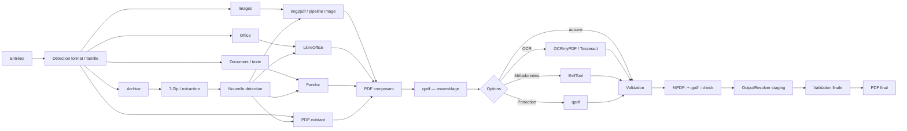

# Graphe de transformation vers PDF

Le mode Smart-to-PDF fait converger plusieurs familles de fichiers vers un PDF validé.

## Validation

FileFlow contrôle d’abord que le fichier :
- existe ;
- possède une taille minimale ;
- commence par la signature `%PDF-`.

Lorsque qpdf est disponible, FileFlow ajoute `qpdf --warning-exit-0 --check`.

## Pourquoi une seconde validation ?

Le pipeline valide le PDF de travail puis le fichier copié vers le staging final. La deuxième validation porte donc sur le fichier réellement destiné à être promu vers le résultat utilisateur.

## Workspace temporaire

Les composants et fichiers techniques restent dans un workspace de job. Le résultat est promu en dehors avant que le workspace soit nettoyé.
