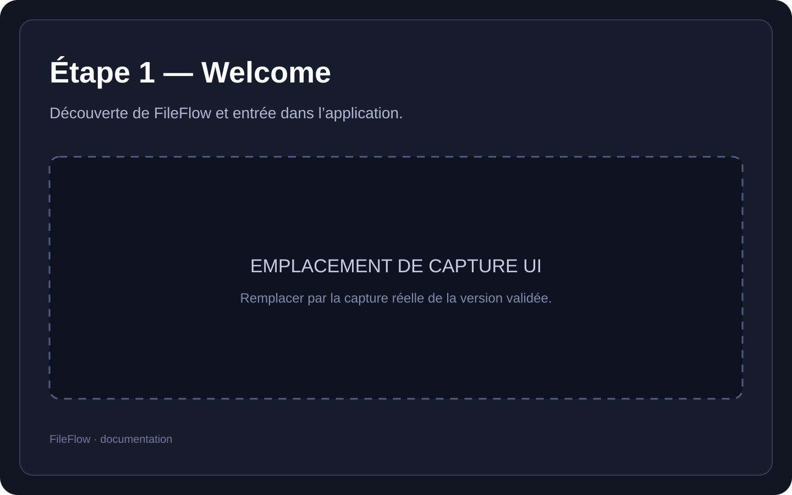
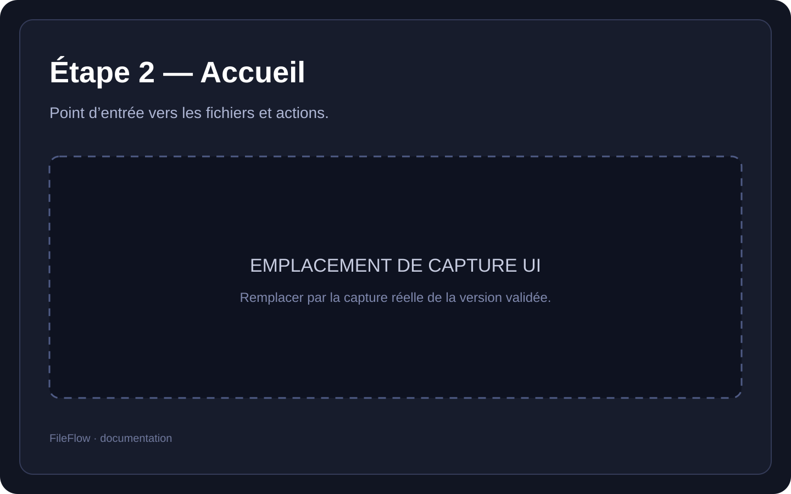
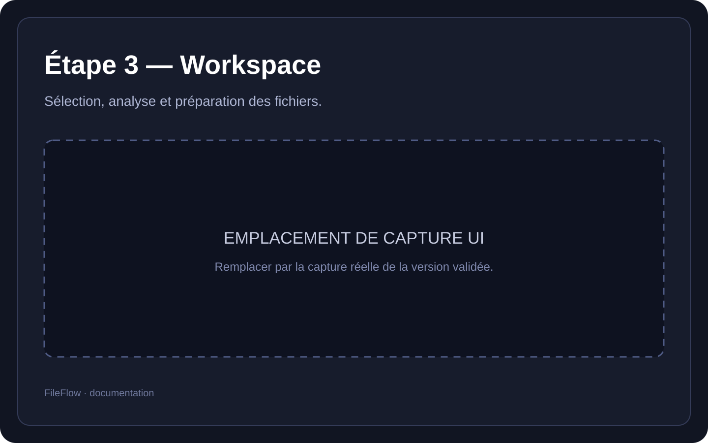
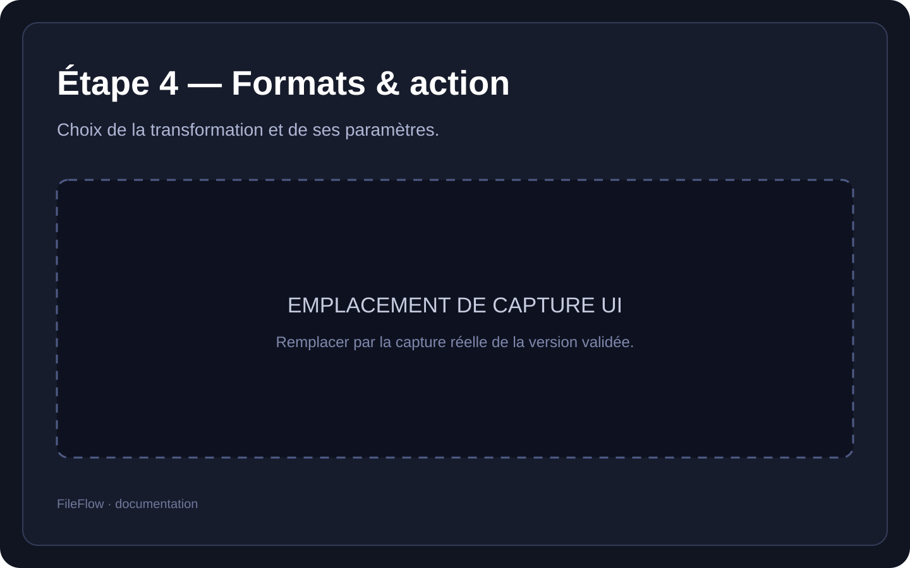
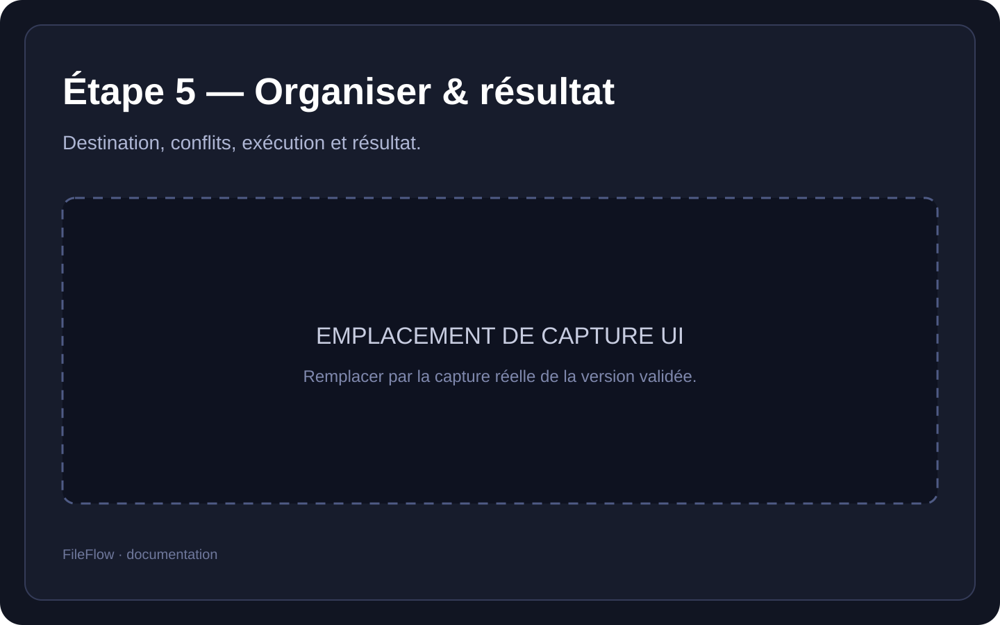
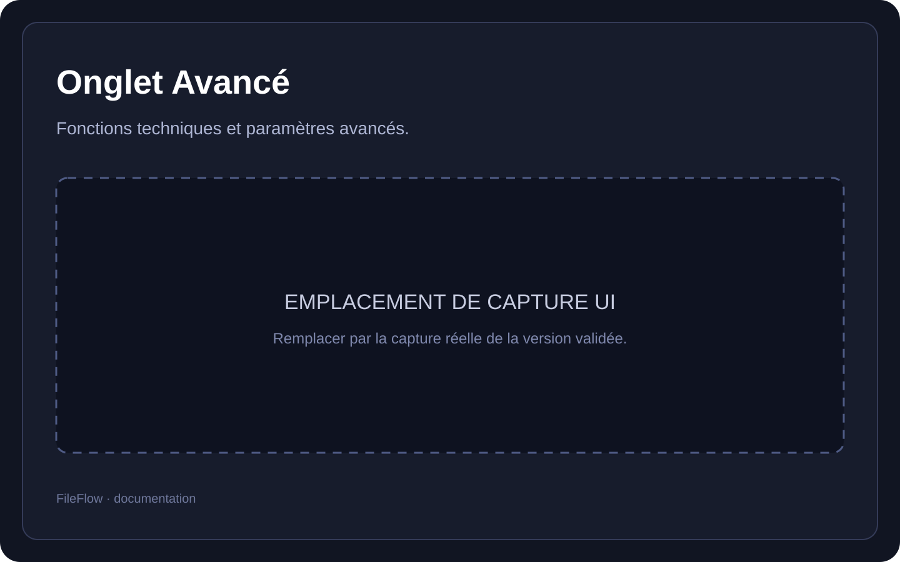
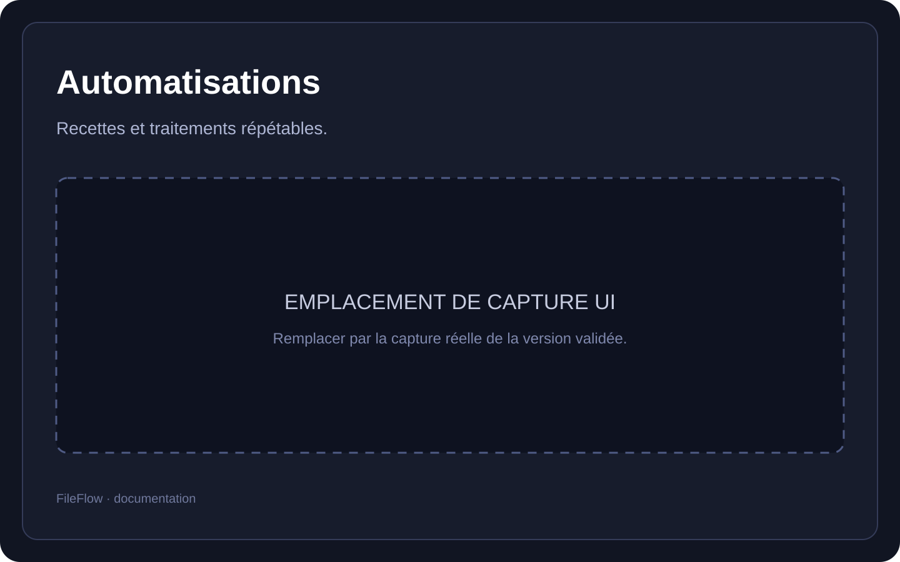
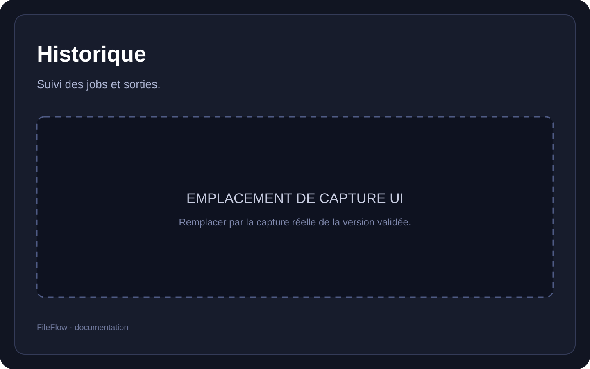
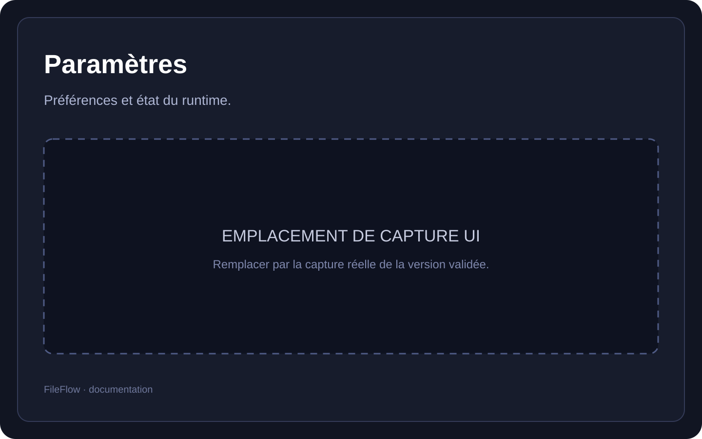

# Interface utilisateur

Cette page définit la documentation visuelle du produit.

**Important :** les SVG présents par défaut sous `doc/assets/ui/` sont des **emplacements de capture**, pas de fausses captures. Ils doivent être remplacés par les captures réelles de la version validée de FileFlow.

## Parcours principal — 5 étapes

### Étape 1 — Welcome

Découverte de FileFlow et entrée dans l’application.

### Étape 2 — Accueil

Point d’entrée vers les fichiers et actions.

### Étape 3 — Workspace

Sélection, analyse et préparation des fichiers.

### Étape 4 — Formats & action

Choix de la transformation et de ses paramètres.

### Étape 5 — Organiser & résultat

Destination, conflits, exécution et résultat.

## Espaces complémentaires

### Onglet Avancé

Fonctions techniques et paramètres avancés.

### Automatisations

Recettes et traitements répétables.

### Historique

Suivi des jobs et sorties.

### Paramètres

Préférences et état du runtime.

## Modules frontend détectés

`advanced`, `automations`, `favorites`, `formats`, `help`, `history`, `home`, `organize`, `settings`, `welcome`, `workspace`

## Convention de captures

Les captures réelles doivent :
- être produites avec la même version FileFlow ;
- utiliser une résolution cohérente ;
- ne contenir aucun chemin personnel ou donnée privée ;
- illustrer un état réaliste de l’application ;
- conserver les mêmes noms de fichiers dans `doc/assets/ui/` afin de ne pas casser les liens Markdown.
