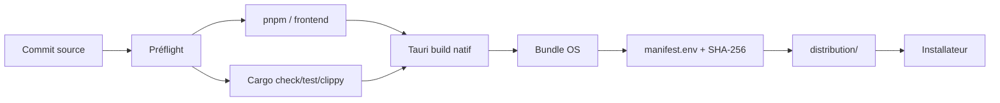

# CI/CD et workflows

## But

La CI vérifie le même code source puis construit les packages sur les plateformes natives. Les moteurs de conversion restent system-managed sur la machine finale.

## Workflows détectés

| Fichier | Nom GitHub Actions | Déclencheurs détectés |
| --- | --- | --- |
| ci.yml | FileFlow Common Quality | push, pull_request |
| native-linux.yml | FileFlow Native Linux | workflow_dispatch, push, pull_request |
| native-macos.yml | FileFlow Native macOS | workflow_dispatch, push, pull_request |
| native-windows.yml | FileFlow Native Windows | workflow_dispatch, push, pull_request |
| release-linux.yml | FileFlow Release Linux | push |
| release-macos.yml | FileFlow Release macOS | push |
| release-windows.yml | FileFlow Release Windows | push |

## Pipeline natif



## Targets

- `windows-x64`
- `macos-arm64`
- `macos-x64`
- `linux-x64`
- `linux-arm64`

## Préflight

Les contrôles couvrent notamment :
- versions Node/pnpm/Rust ;
- métadonnées de release ;
- lockfiles ;
- build frontend ;
- CSP/Tauri ;
- compilation du workspace ;
- cohérence des artefacts.

## Pourquoi des builds natifs ?

Le packaging desktop dépend de l’OS, de son linker, de ses formats de bundle et de ses bibliothèques. Un build réussi sur macOS ne valide pas le package Windows.

## Branches `distribution/*`

Les cinq branches `distribution/*` sont des **canaux d’infrastructure**. Elles contiennent le dernier payload natif vert et `manifest.env` :
- version ;
- commit source ;
- nom du package ;
- SHA-256 ;
- canal.

Elles ne doivent pas être assimilées à des branches de feature.

## Documentation sans CI

Les commits purement documentaires utilisent :

```text
[skip actions]
```

Ainsi, un changement Markdown ou une capture ne déclenche pas volontairement les coûteux builds natifs `push`/`pull_request`.

## Tooling de release

Le tooling de release :
- normalise les noms d’artefacts par target ;
- construit les métadonnées updater ;
- génère les sommes SHA-256 ;
- vérifie l’ensemble des artefacts ;
- contrôle les transitions de version.

## Validation finale

Un workflow vert prouve que le code se construit dans l’environnement CI. Il ne remplace pas les tests réels d’installation et de conversion sur chaque OS avant une release publique.
